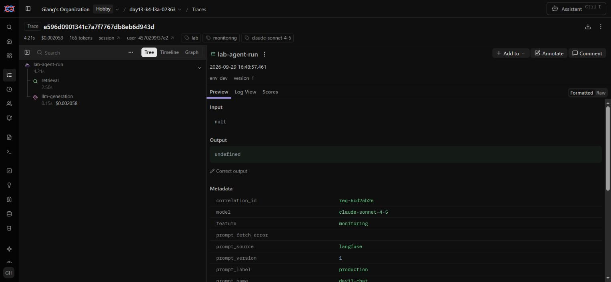

# Báo cáo cá nhân — K4-L3A Day 13 Monitoring & LLMOps

## 1. Thông tin học viên và tiến độ

- **Họ và tên:** Từ Hoàng Giang
- **MSSV:** 2A202602363
- **Lớp:** K4-L3A
- **Repository URL:** https://github.com/gianghoang0810/K4-L3-DAY13-TuHoangGiang-02363-Monitoring-LLMOps
- **Commit source ứng dụng đã kiểm chứng:** [`f614a5c29f4a3552cd9c9a4280a0de4155685ef5`](https://github.com/gianghoang0810/K4-L3-DAY13-TuHoangGiang-02363-Monitoring-LLMOps/commit/f614a5c29f4a3552cd9c9a4280a0de4155685ef5), đã có trên remote. Bản hoàn thiện CP4 chỉ bổ sung script thu evidence, kiểm tra artifact và tài liệu; không thay đổi `app/`, `config/` hoặc tests. **SHA nộp bài là commit chứa bản báo cáo và evidence bổ sung này**, lấy bằng `git rev-parse HEAD` sau khi commit và đối chiếu `git ls-remote origin refs/heads/main` trước khi nộp.
- **Project Langfuse:** `day13-k4-l3a-02363` (ID `cmumco6ni1z2yad0cma0yh742`, region EU).
- **Challenge ID:** `day13-k4-l3a-monitoring-llmops-v1` (Cohort K4, seed 1311, feature: `monitoring`).
- **Tiến độ:** Hoàn thiện source, báo cáo và evidence CP0–CP4; repo cá nhân đã có trên GitHub. Học viên tự nộp URL repo + SHA cuối trên LMS/Codelabs; báo cáo này không xác nhận đã nộp LMS.

## 2. Evidence index

| Evidence thực tế | File |
|---|---|
| Baseline/CP1 | [pytest](evidence/cp1-pytest.txt), [logs](evidence/cp1-log-validator.txt), [dashboard contract](evidence/cp1-dashboard-validator.txt), [health](evidence/cp1-health.txt), [workload](evidence/cp1-workload.txt) |
| Tests hiện tại | [01-pytest.txt](evidence/01-pytest.txt) |
| Log validator hiện tại | [02-log-validator.txt](evidence/02-log-validator.txt) |
| Dashboard validator hiện tại | [03-dashboard-validator.txt](evidence/03-dashboard-validator.txt) |
| Structured log runtime | [04-structured-log.png](evidence/04-structured-log.png) |
| Log runtime đã che PII | [05-pii-redaction.png](evidence/05-pii-redaction.png), [05-pii-redaction.json](evidence/05-pii-redaction.json), [05a bốn request với marker đầy đủ](evidence/05a-pii-runtime.json), [input giả và lệnh tái hiện](../scripts/capture_pii_evidence.py) |
| Danh sách Traces Langfuse | [06-trace-list.png](evidence/06-trace-list.png), [langfuse-setup.json](evidence/langfuse-setup.json), [cp2-cloud-observations.json](evidence/cp2-cloud-observations.json) |
| Cây quan sát Trace Waterfall | [07-trace-waterfall.png](evidence/07-trace-waterfall.png) |
| Trace metadata & tokens/cost | [08-trace-metadata.png](evidence/08-trace-metadata.png) |
| Prompt versions (v1/v2) | [09-prompt-versions.png](evidence/09-prompt-versions.png) |
| Prompt promote/rollback | [10a production v2 trước rollback](evidence/10a-prompt-production-v2.png), [10 production v1 sau rollback](evidence/10-prompt-rollback.png), [prompt-workflow.json](evidence/prompt-workflow.json) |
| Dashboard CP2, 64 requests | [11-dashboard-overview.png](evidence/11-dashboard-overview.png), [11-dashboard-overview.html](evidence/11-dashboard-overview.html), [dashboard-metrics.json](evidence/dashboard-metrics.json) |
| Practice trước/trong/sau sự cố | [practice-investigation.json](evidence/practice-investigation.json) |
| Incident metric (CP3) | [12-incident-metric.png](evidence/12-incident-metric.png) |
| Snapshot dữ liệu incident CP3, 5 requests | [12-incident-dashboard.html](evidence/12-incident-dashboard.html), [12-incident-dashboard-metrics.json](evidence/12-incident-dashboard-metrics.json) |
| Incident log (CP3) | [13-incident-log.png](evidence/13-incident-log.png) |
| Incident trace (CP3) | [14-incident-trace.png](evidence/14-incident-trace.png), [14a correlation ID và span trên cùng trace](evidence/14a-incident-correlation.png) |
| Xác minh sau khắc phục (CP3) | [15-post-fix-verification.json](evidence/15-post-fix-verification.json) |

Đã thu thập bộ minh chứng `01`–`14`; bổ sung runtime JSON `05a` cho bốn loại PII không bị cắt marker, ảnh `10a` trước rollback, ảnh `14a` nối correlation ID với trace và file `15` xác minh sau khắc phục. Dữ liệu JSON Cloud và các snapshot HTML được lưu kèm để đối chiếu. Ảnh `14a` được chụp lại từ trace incident gốc, không tạo incident mới.

## 3. Kết quả kỹ thuật

| Nội dung | Baseline | Kết quả hiện tại |
|---|---|---|
| Log validator | 30/100, 21 records; 20 thiếu trường/context; 0 ID hợp lệ | 100/100; 154 records; 77 correlation IDs; 0 dòng thiếu trường/context; 0 PII leak |
| Dashboard validator | 6/6 contract | 6/6 contract; endpoint `/dashboard` trả HTTP 200, đủ 6 panel và có dữ liệu |
| Pytest | 22 passed | 36 passed |
| PII leak do validator phát hiện | 0 | 0 |
| Traces Cloud | Chưa xác minh lúc baseline | 10 setup + 20 CP2 đã đọc lại; riêng CP2 có 60 observations |
| Latency P50 / P95 / P99 | Chưa tổng hợp | 387 / 2888 / 3382 ms |
| TTFT P95 | Chưa tổng hợp | 53 ms |
| Requests / error rate / retrieval success | Chưa tổng hợp | 64 / 0% / 100% |
| Tokens in / out, cost giả lập | Chưa tổng hợp | 2560 / 8199; $0.130665 |
| Quality proxy trung bình | Chưa tổng hợp | 0.8125 |

Snapshot JSON/HTML CP2: **2026-09-29 07:25:28.964345 → 08:25:28.964345 UTC**. Ảnh `11` chụp dashboard ở cửa sổ muộn hơn: **07:32:07.861894 → 08:32:07.861894 UTC**, cùng ngày. Đây là hai snapshot 60 phút khác nhau, cùng chứa 64 requests và có các giá trị tổng hợp trong bảng trên; không coi timestamp của ảnh và JSON là một. Percentile dùng nearest-rank. Chưa thể kết luận SLO 28 ngày từ mẫu ngắn này. Có 63/64 good requests; một request chậm quá 3000 ms.

## 4. Logging và PII

- Middleware clear context trước request, nhận `x-request-id` hoặc sinh `req-<8-hex>`, bind contextvars và lưu request.state; trả ID cùng `x-response-time-ms`; clear trong finally.
- Context có `user_id_hash` (SHA-256 rút gọn theo helper lab), `session_id`, `feature`, `model`, `env` trước `request_received`.
- Kế thừa Regex/marker từ demo buổi sáng. Thẻ và CCCD được xử lý trước điện thoại để tránh che một phần. Scrub đệ quy dict/list/tuple sau format exception, trước cả JSONL writer và JSON renderer.
- Tests kiểm tra ID client/generated, hai request đồng thời, header/context, bốn loại PII, dữ liệu lồng nhau và exception. Runtime PII chỉ dùng dữ liệu giả; evidence giữ phần đã che.
- **Bổ sung CP4:** chạy `python scripts/capture_pii_evidence.py` qua FastAPI `/chat` thật bằng ASGITransport, mỗi loại PII một request để tránh giới hạn preview 80 ký tự. Input giả nằm trong `CASES` của [script](../scripts/capture_pii_evidence.py); [output thực tế](evidence/05a-pii-runtime.json) lưu correlation ID, timestamp, HTTP 200 và hai events cho mỗi request. Cả `[REDACTED_EMAIL]`, `[REDACTED_PHONE_VN]`, `[REDACTED_CCCD]`, `[REDACTED_CREDIT_CARD]` đều hiện đầy đủ; script kiểm tra không còn fixture nguyên văn trong file/console. Không nạp `.env`, không gửi các request bổ sung lên Cloud; log tạm riêng nên không làm đổi snapshot CP2/CP3 hoặc 154 records dùng cho validator.
- Log baseline đã đổi tên, gitignore và giữ nguyên. CP1 chạy local không nạp `.env`; CP2 nạp `.env` để gửi trace thật lên project cá nhân. Không in/lưu keys trong evidence.

## 5. Tracing và prompt versioning

Root `lab-agent-run` có hai child: `retrieval` (RETRIEVER) và `llm-generation` (GENERATION). Tắt capture raw input/output tự động; generation chỉ gửi prompt/output đã scrub, model, usage và cost. Metadata truyền correlation ID để nối log. Token và cost là số liệu fake LLM, không phải hóa đơn nhà cung cấp.

Prompt text `day13-chat` giữ ba biến `feature`, `docs`, `message`. V2 thêm yêu cầu tối đa ba câu ngắn. Dùng cùng input cho bốn giai đoạn, kiểm tra version từ Cloud; TTL=0 trong workflow để label thay đổi được đọc ngay. App mặc định cache 60 giây.

| Giai đoạn | Label / version | Một trace ID đã xác minh |
|---|---|---|
| Baseline | baseline / v1 | `038329dd7e9149f38999105f940b4984` |
| Candidate | candidate / v2 | `21c71c0ea64691c52bf22d9a89a081e8` |
| Promote | production / v2 | `8591d412849118b8e312f214cf99dffd` |
| Rollback | production / v1 | `700051eceb4ca35b221e1d68f51354e4` |

**Trạng thái trước/sau:** trace [8591d412849118b8e312f214cf99dffd](https://cloud.langfuse.com/project/cmumco6ni1z2yad0cma0yh742/traces/8591d412849118b8e312f214cf99dffd) xác nhận `production` dùng v2 trước rollback; trace [700051eceb4ca35b221e1d68f51354e4](https://cloud.langfuse.com/project/cmumco6ni1z2yad0cma0yh742/traces/700051eceb4ca35b221e1d68f51354e4) xác nhận `production` dùng v1 sau rollback. [Ảnh trước rollback](evidence/10a-prompt-production-v2.png), [ảnh trạng thái cuối](evidence/10-prompt-rollback.png) và [workflow JSON](evidence/prompt-workflow.json) chứa các ID, request ID, thời gian cùng kết quả kiểm chứng. SDK flush sau workload và khi shutdown API.

Lần workflow đầu có timeout export baseline, được giữ trong file history. Lần chạy xác minh cuối gửi 22 requests, Cloud có 20 traces đầy đủ; 2 request practice không được xác nhận do timeout exporter. Không tính request thành công là trace thành công. Script đọc Observations API v2 vì endpoint traces cũ trả 410 cho organization mới.

## 6. Dashboard, SLO và alerts

- Dashboard: `http://127.0.0.1:8000/dashboard`; dữ liệu JSON: `/dashboard/data`. Nguồn duy nhất `data/logs.jsonl`, 60 phút, refresh 30 giây. Có latency P50/P95/P99 và TTFT, traffic, errors/retrieval success, cost, tokens, quality; mỗi panel có đơn vị và threshold. Không đổi dashboard contract để đạt validator.
- Empty data hiển thị N/A; traffic/cost/token bằng 0 khi không có event. Error rate lấy failed/received; retrieval success lấy true/tổng các event có tool_success, bao gồm response_sent và request_failed. Số records malformed bị bỏ qua được hiển thị.
- [SLO](../config/slo.yaml): 99.5% request thành công trong <= 3000 ms / 28 ngày. Giữ ngưỡng lab, có dư địa so với baseline fake LLM; cần đánh giá lại khi chạy model thật.
- Error budget = N * 0.005; 10,000 requests cho phép 50 bad requests. Remaining = allowed - observed bad. Request lỗi và request quá chậm đều tiêu hao budget; request đang xử lý không tự động tính lỗi.
- [Ba alerts](../config/alert_rules.yaml): high_request_latency (>3000 ms, 5m), high_request_error_rate (>2%, 5m), low_answer_quality (<0.75, 10m), có điều kiện đủ mẫu, severity, owner, kênh Slack dự kiến `#day13-02363-alerts` và [runbook](../docs/alerts.md).
- Alerts hiện là cấu hình/đặc tả; chưa nối alert engine hoặc Slack webhook, chưa gửi thông báo thật.

## 7. Điều tra incident

### Practice đã thực hiện — không thay thế CP3

Scenario `rag_slow`, prompt production v1, cùng input; 3 requests mỗi giai đoạn.

| Giai đoạn | Latency P95 | TTFT P95 |
|---|---:|---:|
| Trước practice | 391 ms | 51 ms |
| Bật rag_slow | 3382 ms | 50 ms |
| Sau tắt rag_slow | 400 ms | 69 ms |

- **Metrics:** latency tăng rõ trong practice, TTFT gần như giữ nguyên. Số mẫu ít và thời gian ngắn chưa đủ khẳng định alert duration đã kích hoạt.
- **Log:** `req-53ec76cf`, response_sent latency **3382 ms**, TTFT **50 ms**; session `cp2-20260929T081647-practice-slow`.
- **Trace:** [4c17803710313ce59801aa1bfad24bb4](https://cloud.langfuse.com/project/cmumco6ni1z2yad0cma0yh742/traces/4c17803710313ce59801aa1bfad24bb4).
- **Khoảng request:** 08:17:16.989 → 08:17:20.371 UTC ngày 29/09/2026.
- **Span:** retrieval **2501 ms**, generation **152 ms**, root **3382 ms**; phần thời gian còn lại còn gồm lấy prompt/overhead, không quy hết cho retrieval.
- **Root cause practice:** cờ rag_slow tạo sleep 2.5 giây trong retrieval. Độ dài retrieval span phù hợp với thay đổi được inject.
- **Fix đã kiểm chứng:** tắt rag_slow trong finally; P95 sau đó về 400 ms.
- **Phòng ngừa:** đặt timeout retrieval, cache/fallback khi dependency chậm, theo dõi latency bằng alert và dùng trace để xác định bottleneck.

### Challenge chính thức — K4-L3A (`day13-k4-l3a-monitoring-llmops-v1`)

File cấu hình chính thức từ Lab Coach: `config/challenge.json` (Cohort: **K4**, seed: **1311**, affected feature: **`monitoring`**, latency threshold: **2000 ms**).

- **1. Metrics (Triệu chứng):**
  - Trong khoảng thời gian xảy ra sự cố (`2026-09-29 09:48:55 → 09:49:12 UTC`), Dashboard ghi nhận độ trễ tăng đột biến: **Latency P95 = 4213 ms**, **Latency P50 = 2659 ms** (vượt xa ngưỡng threshold 2000 ms được cấu hình).
  - TTFT P95 của 5 requests là **51 ms** theo dashboard/JSON; riêng request `req-6cd2ab26` có TTFT **50 ms** theo log. TTFT vẫn gần mức bình thường.
  - SLO Attainment giảm từ 100% xuống **80%** (1/5 request vi phạm ngưỡng latency > 3000 ms, làm tiêu hao error budget).
  - Bằng chứng: [12-incident-metric.png](evidence/12-incident-metric.png).
  - Cửa sổ ảnh `12`: **08:55:29.286779 → 09:55:29.286779 UTC**; JSON/HTML CP3 lưu sớm hơn, **08:50:17.384792 → 09:50:17.384792 UTC**, ngày 29/09/2026. Cả hai cửa sổ chứa cùng 5 requests incident, có P95 4213 ms và TTFT P95 51 ms; thời gian request cụ thể ở log nằm trong cả hai.

- **2. Logs (Định vị request):**
  - Lọc log trong khoảng thời gian trên, phát hiện request bị ảnh hưởng nặng nhất:
    - **Correlation ID:** `req-6cd2ab26`
    - **Session ID:** `k4-l3a-challenge-s04`
    - **Event:** `response_sent` lúc `2026-09-29T09:49:01.677362Z`
    - **Latency ghi nhận:** **4213 ms** (TTFT: 50 ms, tokens_in: 36, tokens_out: 130).
  - Bằng chứng: [13-incident-log.png](evidence/13-incident-log.png).

- **3. Traces (Khoanh vùng nguyên nhân gốc):**
  - Mở trace trên Langfuse Cloud có cùng Correlation ID `req-6cd2ab26`:
    - **Trace ID:** [`e596d0901341c7a7f7767db8eb6d943d`](https://cloud.langfuse.com/project/cmumco6ni1z2yad0cma0yh742/traces/e596d0901341c7a7f7767db8eb6d943d).
    - Cây quan sát phân rã thời gian:
      - Root span `lab-agent-run`: **4215 ms**
      - Child span `retrieval` (RETRIEVER): **2503 ms** (chiếm phần lớn thời gian xử lý)
      - Child span `llm-generation` (GENERATION): **153 ms**
  - Bằng chứng: [14-incident-trace.png](evidence/14-incident-trace.png) và ảnh metadata bổ sung bên dưới. Ảnh `14a` thấy trực tiếp project, trace ID, `correlation_id=req-6cd2ab26`, prompt production v1 và cây span. Langfuse hiển thị giờ UTC+7: **16:48:57.461**, tương ứng **09:48:57.461 UTC** bắt đầu root; log kết thúc lúc **09:49:01.677362 UTC**.

- **4. Root cause (Nguyên nhân cốt lõi):**
  - **`retrieval` là nguyên nhân chính do incident inject**: span này mất 2503 ms vì `rag_slow` thêm độ trễ 2.5 giây vào dependency vector retrieval. `llm-generation` chỉ mất 153 ms và TTFT là 50 ms. Root span dài khoảng 4215 ms nên còn khoảng 1559 ms ngoài hai child spans, gồm thời gian lấy prompt và overhead chưa được instrument thành span riêng; vì vậy không quy toàn bộ latency cho retrieval.

- **5. Fix action (Hành động khắc phục):**
  - Vô hiệu hóa sự cố bằng `python scripts/inject_incident.py --disable`, sau đó chạy lại đúng 5 query challenge. Cả 5 `response_sent` mới đều dưới 400 ms theo server log; cao nhất **318 ms**. Xem [15-post-fix-verification.json](evidence/15-post-fix-verification.json).

- **6. Preventive measure (Biện pháp phòng ngừa lâu dài):**
  - Đặt timeout chặt chẽ cho bước retrieval (ví dụ: tối đa 500 ms) để tránh treo request của người dùng khi dependency gặp sự cố.
  - Xây dựng cơ chế fallback (trả lời theo context rút gọn hoặc knowledge cache) khi retrieval timeout.
  - Kích hoạt cảnh báo tự động `high_request_latency` (> 3000 ms duy trì trong 5 phút) để khớp với SLO và dashboard, giúp đội ngũ vận hành phản ứng trước khi tiêu hao error budget.

## 8. Giải thích và tự đánh giá

- **Quyết định:** giữ contextvars, JSON processors và Regex từ bài sáng, điều chỉnh cho schema và yêu cầu PII của lab. Dashboard tính từ logs thay vì trộn số liệu Langfuse.
- **Blocker:** baseline thiếu context; API traces cũ không dùng được; exporter timeout; kết nối tab cũ bị timeout. Đã sửa context, dùng API v2, tăng timeout và chỉ tính traces Cloud xác nhận. Mở tab Langfuse mới đã chụp được ảnh `14a` bổ sung; runtime `05a` giải quyết marker PII bị cắt trong evidence cũ.
- **Metrics → Logs → Traces:** metrics chỉ triệu chứng/khoảng thời gian; log chỉ request bằng correlation ID; trace của request chỉ span gây chậm/lỗi. Đã áp dụng điều tra thành công cả trong practice và challenge chính thức K4-L3A.
- **Prompt version / token-cost / SLO / rollback:** truy xuất đúng prompt, theo dõi tài nguyên, đặt mục tiêu dịch vụ và phục hồi version trước. Fake LLM không cho phép kết luận v2 có chất lượng tốt hơn v1.
- **Bài học:** health hoặc tests starter đạt không chứng minh observability đầy đủ; cần evidence runtime và đối chiếu Cloud.
- **Giới hạn:** Regex không nhận diện mọi tên/địa chỉ; Slack delivery chưa được kiểm chứng vì lab chỉ yêu cầu cấu hình kênh/runbook; khoảng 1559 ms của trace incident chưa có child span riêng. Việc nộp LMS do học viên thực hiện, tách biệt với việc push repo.

### Source, tests và lịch sử Git để đối chiếu

| Phần kỹ thuật | Source/config | Tests |
|---|---|---|
| Correlation/context và log | [middleware](../app/middleware.py), [logging processors](../app/logging_config.py), [API](../app/main.py) | [context/PII integration](../tests/test_cp1_logging.py), [chat observability](../tests/test_chat_observability.py) |
| PII redaction | [PII helpers](../app/pii.py), [script runtime với input giả](../scripts/capture_pii_evidence.py) | [PII tests](../tests/test_pii.py) |
| Tracing và prompts | [agent](../app/agent.py), [tracing](../app/tracing.py), [prompt management](../app/prompt_management.py) | [agent/prompt trace](../tests/test_agent_prompt_trace.py), [prompt tests](../tests/test_prompt_management.py) |
| Dashboard/SLO/alerts | [dashboard](../app/dashboard.py), [SLO](../config/slo.yaml), [alerts](../config/alert_rules.yaml), [runbooks](../docs/alerts.md) | [runtime dashboard](../tests/test_dashboard_runtime.py), [SLO/alerts](../tests/test_slo_alerts.py) |
| Incident | [retrieval](../app/mock_rag.py), [incident control](../app/incidents.py), [inject script](../scripts/inject_incident.py) | [challenge contract](../tests/test_challenge_config.py) |

Lịch sử: [commit triển khai c8aee38](https://github.com/gianghoang0810/K4-L3-DAY13-TuHoangGiang-02363-Monitoring-LLMOps/commit/c8aee38c5d3fb9c032fc99ce152c63fc000c6320), [commit báo cáo f614a5c](https://github.com/gianghoang0810/K4-L3-DAY13-TuHoangGiang-02363-Monitoring-LLMOps/commit/f614a5c29f4a3552cd9c9a4280a0de4155685ef5). Evidence kiểm tra cuối: [pytest](evidence/01-pytest.txt), [logs](evidence/02-log-validator.txt), [dashboard](evidence/03-dashboard-validator.txt), [artifact scan](evidence/submission-checks.txt).

## 9. Checklist trước khi nộp

- [x] Logging/PII và tracing có code, tests và evidence runtime/API.
- [x] Prompt v1/v2 và promote/rollback đã xác minh; production về v1.
- [x] Dashboard có dữ liệu; SLO/error budget và ba alert/runbook đã điền.
- [x] Thu đủ ảnh thật CP1 và CP2 (từ `04` đến `11`) theo [SUBMISSION.md](../docs/SUBMISSION.md).
- [x] Chạy challenge đúng lớp K4-L3A; bổ sung đầy đủ incident evidence chính thức (ảnh 12, 13, 14).
- [x] Kiểm tra file/link/credential dạng text và chạy lại tests/validators trên working tree cuối: 36 tests, log 100/100, dashboard 6/6.
- [x] Repo cá nhân đã có trên GitHub; đã xác nhận commit source `f614a5c` trên remote.
- [x] Bổ sung evidence PII đầy đủ và ảnh incident có correlation ID; dẫn trực tiếp source/tests/commit.
- [ ] Học viên nộp URL repo + SHA commit cuối đã push lên LMS/Codelabs trước deadline.
